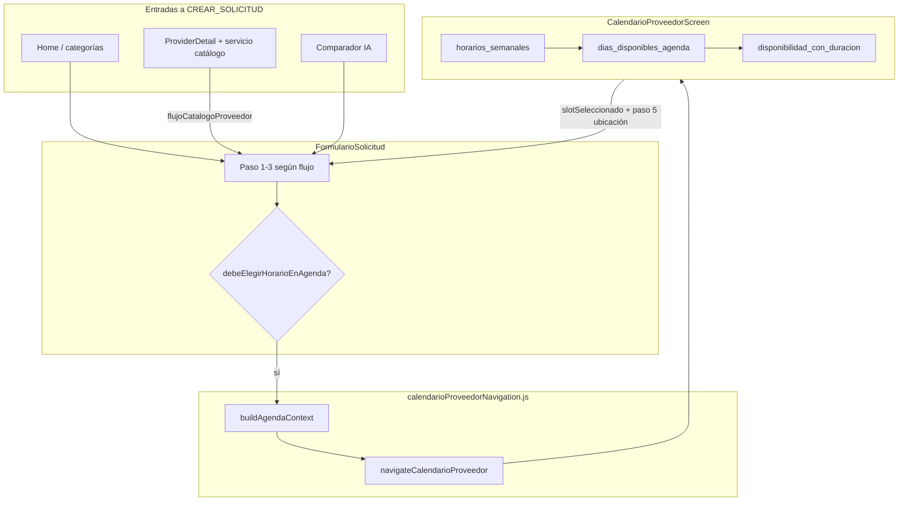

# Diseño — Calendario proveedor (contexto unificado)

Documentación de referencia para agentes y desarrolladores. Actualizar este archivo si se
modifica el flujo de agenda.

## Diagrama de flujos



## Contrato `agendaContext`

Objeto que **debe** viajar en `route.params` al abrir `CalendarioProveedor`:

```javascript
{
  tipoProveedor: 'taller' | 'mecanico',
  proveedorId: number,        // PK Taller o MecanicoDomicilio
  proveedorEntityId: number,  // mismo que proveedorId
  ofertaServicioId: number | null,  // obligatorio en flujo catálogo/perfil
}
```

`returnParams` al volver debe incluir los mismos campos más `servicios_seleccionados`,
`proveedores_dirigidos`, `slotSeleccionado`.

## Resolución de tipo e ID

| Fuente | Campo tipo | Campo entidad |
|--------|------------|---------------|
| Perfil / explore | `providerType` → `tipoProveedorPreseleccionado` | `buildProviderForSolicitud` → `proveedor_entity_id` |
| Proveedor en form | `proveedor.tipo` / `_panelKind` | `proveedor_entity_id`, `taller_id`, `mecanico_id` |
| Comparador | `oferta.tipo_proveedor` | `oferta.proveedor_id` |
| Ruta calendario | `agendaContext` o `route.params` | `proveedorId` |

**Regla:** `resolveTipoProveedor` **no** usa default silencioso a `taller`. Si `tipo` es null, el calendario muestra error claro.

**Regla:** `resolveProveedorEntityId` prioriza `proveedor_entity_id`; luego `taller_id` o `mecanico_id` según tipo; `id` solo si ya es entidad (perfil normalizado).

## APIs backend (base `/api/usuarios/`)

| Tipo | Horario semanal | Días con slots | Slots del día |
|------|-----------------|----------------|---------------|
| Taller | `GET talleres/{id}/horarios_semanales/` | `GET talleres/{id}/dias_disponibles_agenda/?oferta_servicio_id=` | `GET talleres/{id}/disponibilidad_con_duracion/?fecha=&oferta_servicio_id=` |
| Mecánico | `GET mecanicos-domicilio/{id}/horarios_semanales/` | idem | idem |

- `horarios_semanales`: solo filas reales en BD; sin config → `[]`.
- `oferta_servicio_id`: debe pertenecer al mismo proveedor (filtro en `disponibilidad_proveedor.py`).
- Errores de cálculo: 200 con `slots_disponibles: []` (no 500).

## Flags de flujo en `FormularioSolicitud`

| Flag | Efecto en calendario |
|------|----------------------|
| `flujoCuatroPasos` | Servicio + proveedor preseleccionados; calendario tras paso 3 |
| `flujoCatalogoProveedor` | `requireOferta: true` en `buildAgendaContext` |
| `fromProviderDetail` | Proveedor dirigido; tipo desde `initialData` |
| `agendamientoInteligente` | No abre calendario en paso proveedor (comparador después) |

## Carga de días en cliente

`resolverFechasAgendaReales`:

1. `horarios_semanales` → `horariosSemanalesConfigurados` (requiere `id` en fila).
2. Intenta `dias_disponibles_agenda` (una llamada).
3. Fallback: `disponibilidad_con_duracion` por cada día laborable (paralelo, ignora errores puntuales).

## Checklist al agregar un nuevo entry point al calendario

- [ ] ¿Se pasa `providerType` / `tipoProveedor` explícito?
- [ ] ¿`proveedorId` es entidad taller/mecánico, no usuario?
- [ ] ¿`oferta_servicio_id` viene del catálogo si aplica?
- [ ] ¿Se usa `navigateCalendarioProveedor` o `buildAgendaContext`?
- [ ] ¿Probar taller y mecánico en dispositivo contra API de producción?

## Referencias OpenSpec relacionadas

- `openspec/specs/agendamiento-calendario-proveedor/spec.md` (requirements)
- `openspec/changes/agendamiento-disponibilidad-duracion/` (slots por duración)
- `openspec/changes/home-discovery-fase8-2-perfil-proveedor-catalogo/` (perfil → solicitud)
- Backend: `openspec/specs/agendamiento-disponibilidad/spec.md`
