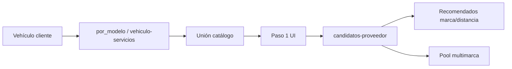

# Diseño — catálogo paso 1 especialista + multimarca

## Flujo

## Módulos usuarios

| Módulo | Rol |
|--------|-----|
| `catalogo_vehiculo.py` (backend) | Fuente única de verdad del queryset |
| `solicitudCatalogoServicios.js` | Filtrado y mensajes |
| `useServiciosPaso1Catalogo.js` | Query + memo cobertura |
| `SolicitudPaso1CoberturaHint.js` | UI badges especialista / multimarca |

`FormularioSolicitud` consume el hook; no llama APIs de catálogo directamente.

## Comparador

`motor_match._queryset_ofertas_compatibles` alinea criterio con catálogo: especialistas en marca + proveedores multimarca verificados. La clasificación existente (`recomendados` / `otros`) y score por distancia no cambia de contrato.
